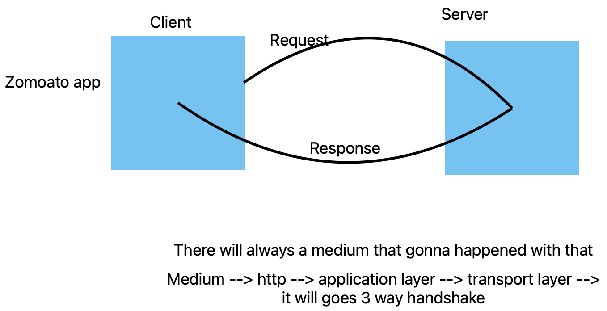

# Client- Server Architecture & REST!!

Client --> any end-system(mobile,broswer,script) that initials a request is actually considered a client
 in client, client are  which are originate a request.

 Server --> any end system(a process running on the machine , and ....) that acts actually recieve a request, process some data and split something out of it.
 it is called server.
 

## REST GUIDELINES
    - as set of guidelines that drive the Architecture of the web
    - rest provide the bunch of guideline that helps to prepare a good api
    - rest prefers a client server communication should happen over http.
    - rest prefers JSON as a format to send and recieve the data.
    - rest gives guidelines how the url looks like
      - in rest, the main source of info. is considered as a resources.
      - example:
        - tweet,like --> resource --> NOUN
        - create a tweet, delete a tweet --> action --> VERBS
    - rest says that URLS/endpoints should be noun not a verb.
    - we never mention the action on the urls.
      - ex: medium.com/blogs
      - ex: medium.com/blogs/2
    - these nouns that we mention are expected to be plural.
    - every rest endpoint should be defined along with a http method.
      - GET --> retreive somedata.
      - POST --> sending the data or creating a resource
      - DELETE --> delete a resource.
      - PUT --> update a resource.
      - PATCH --> partial update of the resource.
    - we use nesting for the relationships.(NOT's use more than 3 level nesting)
        - /blogs/13/comments/
        - /blogs/12/comments/3
    - rest expects to response hace http codes.
    - It helps in VERSIONING 
    - Sending data in the 3 ways:
        - Request body --> we can config programmitcally or some tools like postman
        - URL params  /blogs/:id --> :id is the url params
        - Query params --> /products ? category=Electronic & company=apple 

REST API --> any api that follows the recommendation of REST is a rest api.

[what is rest](https://www.codecademy.com/article/what-is-rest)

# MVC Architecture(Typical restruant example)
  - It is just a coding pattern.

View --> this is a first point of interaction.
Controller --> intermeidate layer between view and model.
  - middleware -> it works a validator.
  - controller --> two works  --> forward the request to the model -> prepare the response object. 
models --> business logic. and DB interaction

# Monolithic vs mircoservice

While setup MVC we can implements in twos:
 feature based
 components based